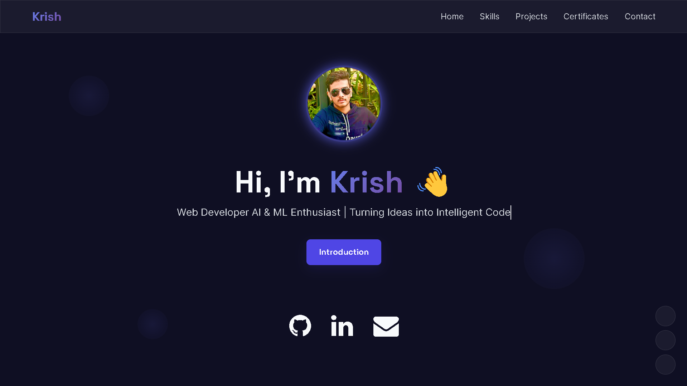
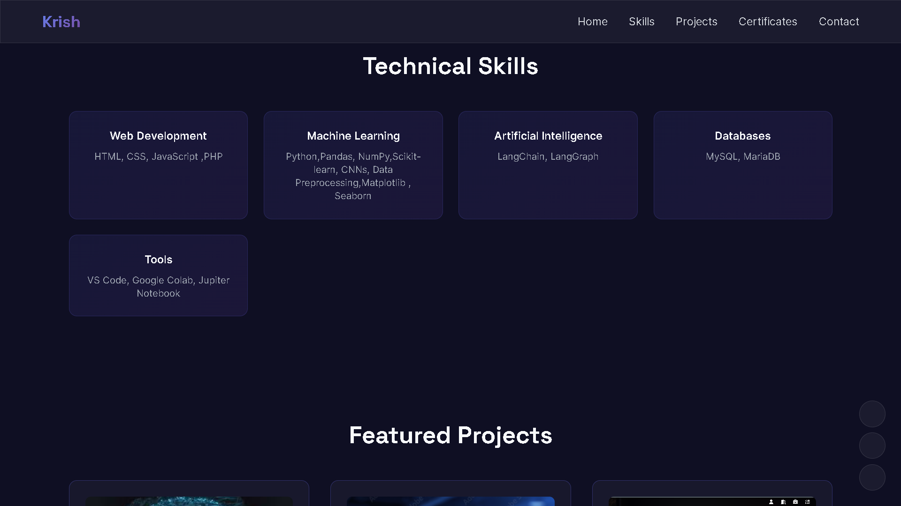
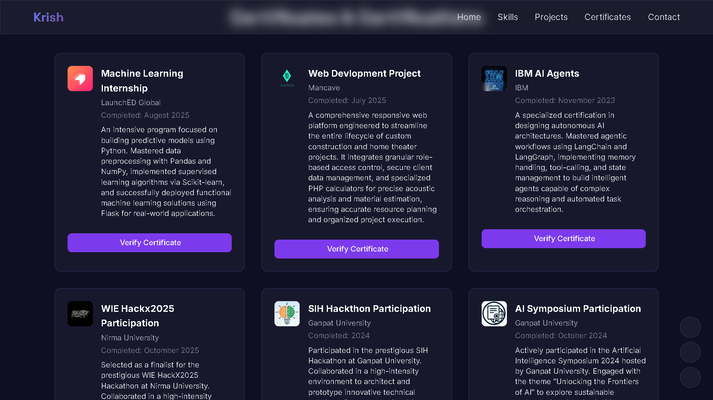

# 🌐 Krish's Personal Portfolio

A modern, fully responsive **personal portfolio website** showcasing my skills, projects, certifications, and professional journey.  
Designed with smooth animations, interactive UI elements, and an AI-powered voice introduction to create an engaging user experience.

---

## 🔗 Live Website

👉 **Visit Portfolio:**  
https://p-psi-six.vercel.app/

---

## 📸 Screenshots

### 🏠 Home Section


### 🛠 Skills Section


### 💼 Projects Section


### 🎓 Certificates Section


## ✨ Features

- 🎨 Modern UI with **Tailwind CSS**
- 📱 Fully **responsive design**
- 🗣 AI-powered **voice-based portfolio introduction**
- 🧠 Interactive animations & transitions
- 🖼 Project showcase with images and links
- 📜 Certifications & achievements section
- 📄 Resume download option
- 🔗 Social media & contact integration

---

## 🛠 Tech Stack

**Frontend**
- HTML5
- CSS3
- Tailwind CSS
- JavaScript (ES6)

**Libraries & Tools**
- Font Awesome
- Phosphor Icons
- Google Fonts
- Speech Synthesis API

**Tools**
- VS Code
- Git & GitHub

---

## 📂 Project Structure

```text
portfolio/
│
├── index.html
├── css/
│   └── all.min.css
├── images/
│   ├── krish1.jpg
│   ├── PortFolioSnap.png
│   ├── LaunchED.jpg
│   └── ...
├── resume.pdf
├── README.md
